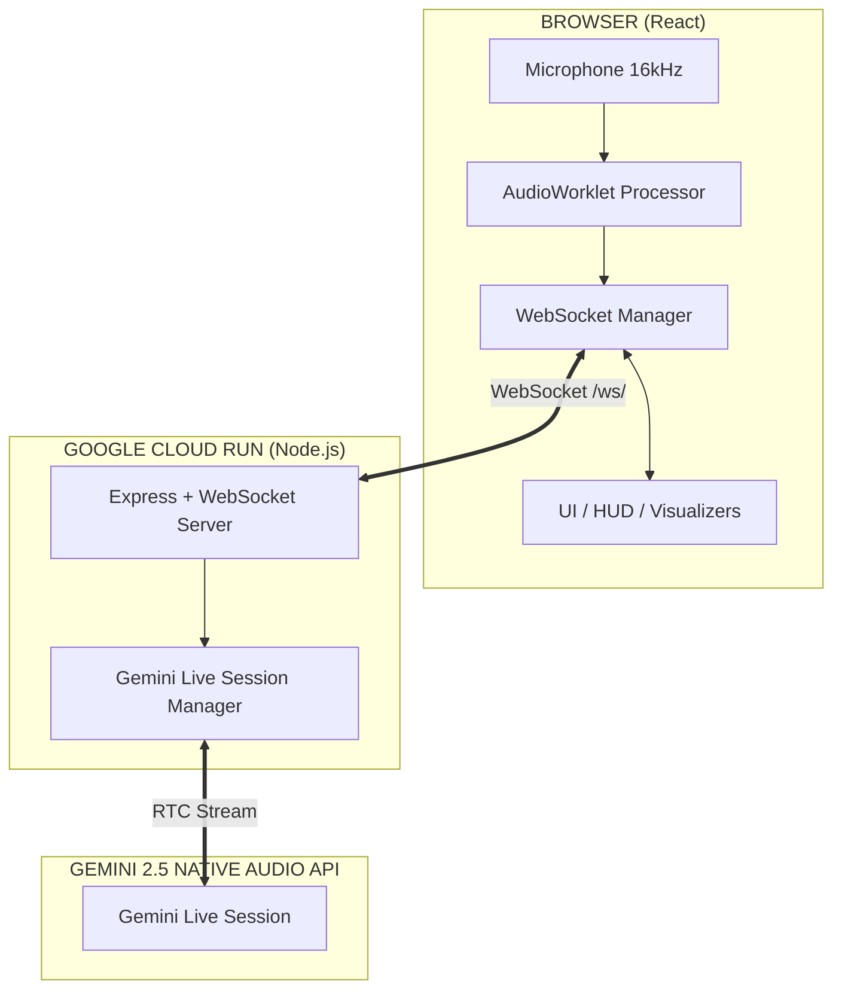

<div align="center">
  <h1> Personal Operator</h1>
  <i>A Next-Generation Real-Time Voice AI Agent powered by Gemini 2.5 Live API</i>
  <br/><br/>
  <b>Built for the Gemini Live Agent Challenge — Live Agents  Category</b>
  <br/><br/>
  <a href="https://personal-ai-operator-677446941082.us-central1.run.app/"> Live Demo</a> |
  <a href="./ARCHITECTURE.md"> Architecture Diagram</a>
</div>

---

> [!IMPORTANT]
> **Submission & Usage Notice**: This repository is submitted exclusively for the **Gemini Live Agent Challenge 2025**. Any unauthorized cloning, redistribution, or commercial use of this codebase is strictly prohibited. Final review is reserved for official judges.

##  What Problem Does It Solve?

Most AI assistants feel slow and robotic — they wait for you to finish speaking, then take seconds to respond. **Personal Operator** eliminates this friction by enabling **natural, interruption-friendly real-time voice conversations** powered by Google Gemini 2.5 Native Audio Live API.

It goes beyond a chatbot — it's a **personal system orchestrator** you can *talk* to. It monitors your infrastructure, tracks your missions, and acts autonomously on your behalf.

---

##  Key Features

| Feature | Description |
|---|---|
|  **Real-Time Voice Streaming** | Bidirectional PCM audio streaming at 16kHz using Gemini Live API |
|  **Zero Delay Interruption** | VAD-based barge-in: interrupt Gemini mid-sentence naturally |
|  **Live Transcription** | Shows what you said and what Gemini replied, in real-time text |
|  **Bilingual** | Understands and responds in Urdu + English natively |
|  **Screen Vision** | Share your screen and let Gemini "see" and comment on it |
|  **Autonomous Missions** | AI autonomously tracks and updates your active goals |
|  **System Health Monitor** | Real-time CPU/RAM monitoring with HUD dashboard |
|  **Live Tool Execution** | Voice-triggered shell commands, code fixes, file operations |
|  **Cloud Native** | Fully deployed on Google Cloud Run |

---

## Architecture



---

##  Running Locally (Spin-Up Instructions)

### Prerequisites
- Node.js v20+
- A valid [Google Gemini API Key](https://aistudio.google.com/app/apikey)

### 1. Clone & Install
```bash
git clone https://github.com/Musab1khan/gemini_live_agent.git
cd gemini_live_agent
npm install
```

### 2. Set Environment
```bash
export API_KEY="your_gemini_api_key_here"
```

### 3. Build
```bash
npm run build
```

### 4. Start
```bash
npm start
```
App will be available at `http://localhost:3000`

>  Chrome requires HTTPS or `localhost` for microphone access.

---

##  Cloud Deployment (Automated)

This project earns the **Infrastructure-as-Code bonus** with a fully automated deploy script.

### Prerequisites
- [gcloud CLI](https://cloud.google.com/sdk/docs/install) installed and authenticated
- Cloud Run & Cloud Build APIs enabled

### One-Command Deploy
```bash
export API_KEY="your_api_key"
npm run build && ./deploy.sh
```

The `deploy.sh` script automatically:
- Builds a Docker container using Cloud Build
- Pushes and deploys to Cloud Run (region: `us-central1`)
- Sets environment variables securely
- Configures unauthenticated public access

### Manual Deploy (alternative)
```bash
gcloud run deploy personal-ai-operator \
  --source . \
  --region us-central1 \
  --allow-unauthenticated \
  --set-env-vars="API_KEY=$API_KEY"
```

---

##  Tech Stack

| Technology | Purpose |
|---|---|
| **Gemini 2.5 Flash Native Audio Live** | Real-time Bidirectional Voice AI |
| **@google/genai SDK v1.41+** | Official Google GenAI SDK for Live API |
| **React 19 + TypeScript** | Frontend UI |
| **Node.js + Express** | Backend WebSocket Server |
| **Web Audio API + AudioWorklet** | Low-latency PCM Microphone Processing |
| **Google Cloud Run** | Serverless Container Hosting |
| **WebSocket (ws)** | Real-time Browser ↔ Server communication |

---

##  Hackathon Compliance

  **ALL THREE Categories Covered**:
- **Live Agents ** — Real-time interruption-capable voice agent with Gemini Live API
- **Creative Storyteller ** — Interleaved multimedia output (text + generated images)
- **UI Navigator ** — Visual UI understanding & automated interaction

 **Mandatory Requirements**:
-  **Gemini Live API** — `ai.live.connect()` with native audio streaming
-  **@google/genai SDK** — Official Google GenAI SDK v1.41+
-  **Google Cloud Run** — Backend deployed and live
-  **Multimodal** — Voice + Screen Vision + Text + Audio + Image Generation
-  **Architecture Diagram** — Included below
-  **Automated Deployment** — `deploy.sh` IaC script (bonus points)

---

##  System Documentation
- [ARCHITECTURE.md](./ARCHITECTURE.md) - Full technical breakdown
- [DEMO_SCRIPT.md](./DEMO_SCRIPT.md) - Multi-scene video script
- [BLOG_POST.md](./BLOG_POST.md) - Project submission write-up

---

##  NEW: Creative Storyteller Features

### Interleaved Multimedia Output
The Creative Storyteller module generates **mixed media content** - text and images woven together in a single fluid output:

```typescript
// Example: Create interleaved story
POST /api/storyteller
{
  "action": "create_story",
  "payload": {
    "topic": "Space travel to Mars",
    "style": "educational",
    "audience": "children",
    "segments": 5
  }
}

// Returns: Array of segments alternating text + images
[
  { "type": "text", "content": "Mars is the fourth planet..." },
  { "type": "image", "content": "base64_image_data..." },
  { "type": "text", "content": "The journey takes 9 months..." }
]
```

### Marketing Asset Generator
Create complete marketing materials with copy + visuals:
```bash
curl -X POST https://your-app/api/storyteller \
  -H "Content-Type: application/json" \
  -d '{
    "action": "marketing_asset",
    "payload": {
      "product": "AI Assistant",
      "description": "Voice-controlled AI helper",
      "platform": "instagram"
    }
  }'
```

### Educational Explainers
Generate diagrams + narration for complex topics:
```bash
POST /api/storyteller
{
  "action": "educational",
  "payload": {
    "topic": "Neural Networks",
    "complexity": "simple"
  }
}
```

---

##  NEW: UI Navigator Features

### Visual UI Understanding
The UI Navigator captures screenshots and identifies all interactive elements:

```typescript
// Analyze current screen
POST /api/navigator
{
  "action": "analyze"
}

// Returns:
{
  "elements": [
    { "id": "1", "type": "button", "label": "Submit", 
      "location": {"x": 45, "y": 60, "width": 10, "height": 5} },
    { "id": "2", "type": "input", "label": "Email", 
      "location": {"x": 20, "y": 30, "width": 40, "height": 5} }
  ],
  "screenshot": "base64_image_data",
  "analysis": "Login form with email and password fields"
}
```

### Automated UI Interaction
Create and execute navigation plans:
```typescript
// Create plan to achieve a goal
POST /api/navigator
{
  "action": "create_plan",
  "payload": {
    "goal": "Fill out the contact form"
  }
}

// Execute the plan
POST /api/navigator
{
  "action": "execute_plan",
  "payload": {
    "plan": {
      "goal": "Fill contact form",
      "steps": [
        { "type": "click", "coordinates": {"x": 30, "y": 40} },
        { "type": "type", "text": "john@example.com" },
        { "type": "click", "coordinates": {"x": 50, "y": 60} }
      ]
    }
  }
}
```

### Cross-Application Workflows
Automate tasks across multiple apps:
```typescript
POST /api/navigator
{
  "action": "automate_workflow",
  "payload": {
    "steps": [
      { "app": "Calculator", "action": "Calculate 2+2" },
      { "app": "Notes", "action": "Paste result" }
    ]
  }
}
```

### Visual QA Testing
Automated UI testing:
```typescript
POST /api/navigator
{
  "action": "visual_qa",
  "payload": {
    "testCases": [
      { "element": "Submit button", "expected": "visible" },
      { "element": "Error message", "expected": "hidden" }
    ]
  }
}
```

---

##  All 60+ Features

### Core Multimodal (All 3 Hackathon Categories)
-  **Live Voice Chat** - Gemini 2.5 Flash Native Audio (Live Agents)
-  **Screen Sharing** - Real-time screen analysis (Live Agents)
-  **Webcam Vision** - Camera feed to AI (Live Agents)
-  **Interleaved Output** - Text + images mixed (Creative Storyteller)
-  **Visual UI Analysis** - Screenshot → element detection (UI Navigator)
-  **Automated Interaction** - Click, type, scroll automation (UI Navigator)
-  **Cross-App Workflows** - Multi-application automation (UI Navigator)

### Intelligence Layer
-  **Multi-Agent Swarm** - 6 AI agents working parallel
-  **Self-Healing Code** - Auto-fix runtime errors
-  **Code Review AI** - Deep PR analysis with fixes
-  **Documentation Generator** - Auto-create README, API docs
-  **Knowledge Graph** - Persistent memory across sessions
-  **Emotion Engine** - Detect and adapt to user sentiment

### System Integration
-  **Email Integration** - Read/send emails, auto-reply
-  **Calendar Sync** - Google/Outlook integration
-  **Screenshot OCR** - Extract text from images
-  **Voice Transcription** - Notes from audio
-  **Document Templates** - Auto-generate proposals, reports
-  **Meeting Minutes** - Auto-generate from voice

### Deployment & DevOps
-  **One-Click Deploy** - Cloud Run pipeline
-  **Predictive Alerts** - Smart notifications
-  **Health Monitoring** - Real-time CPU/RAM metrics
-  **Visual QA Testing** - Automated UI verification
-  **Deployment Pipeline** - Build, test, deploy automation

---

---

##  Live URLs

- **App**: https://personal-ai-operator-677446941082.us-central1.run.app/
- **API Model**: `gemini-2.5-flash-native-audio-preview-...`


###  Let's Connect!
For more professional projects and AI innovations, visit my GitHub profile:
 [**Musab1khan on GitHub**](https://github.com/Musab1khan)
