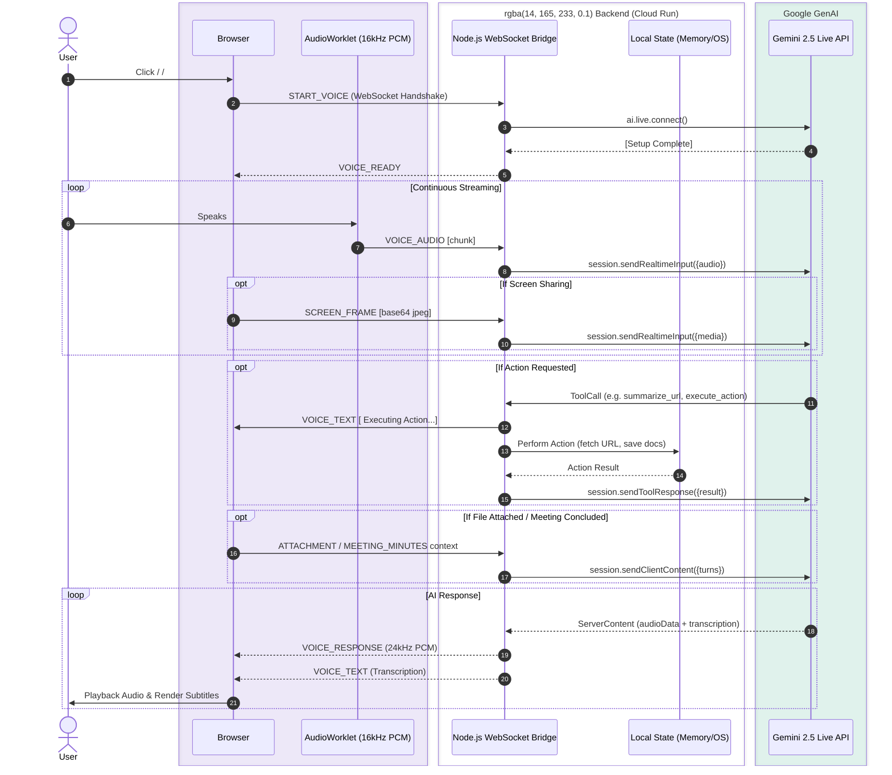

#  System Architecture: Personal Operator

This document details the high-level architecture of the **Personal Operator** system. Built for the Google Gemini Live Agent Challenge, this system orchestrates real-time bidirectional voice (PCM), computer vision (screen sharing), and autonomous tool calling via Google Cloud Run and WebSockets.

---

## 🧭 High-Level Flow Diagram

The following Mermaid sequence diagram outlines the real-time, low-latency communication flow between the Browser (Client), the Node.js Express Sidecar (Server), and the Gemini 2.5 Flash Native Audio Live API.

---

##  Core Components

### 1. Browser Interface (React 19 + Vite)
- **Audio Recorder**: Uses the native Web Audio API and `AudioWorkletNode` to capture raw audio chunks at `16kHz` (the format natively supported by Gemini).
- **Video Capture (Screen Vision)**: Uses `getDisplayMedia` to capture the user's screen at 5fps, encoding each frame as a small JPEG and streaming via WebSocket.
- **WebSocket Client**: Maintains a persistent connection to the Node.js backend to enable full-duplex communication without the overhead of repeated HTTP headers.

### 2. Node.js WebSocket Bridge (Express + `ws`)
- **Gemini Session Manager**: Wraps the `@google/genai` (v1.41.0+) official SDK. Uses `ai.live.connect()` to open an outbound secure WebSocket to Google servers.
- **Relay Mechanism**: Converts incoming `VOICE_AUDIO` binary JSON wrapper into proper `sendRealtimeInput({audio: Blob})` objects.
- **Live Function Calling Engine**: Intercepts `msg.toolCall` from Gemini. Mapped tools include:
  - `summarize_url`: Server fetches URL content and provides it to Gemini.
  - `export_to_docs`: Server parses Gemini outputs and triggers file downloads.
  - `execute_action`: Server simulates system-level shell execution.
  - *Returns results via `sendToolResponse()`.*

### 3. Gemini 2.5 Flash Native Audio Live API
- Uses the `models/gemini-2.5-flash-native-audio-latest` endpoint.
- Provides immediate native VAD (Voice Activity Detection), meaning it inherently knows when the user stops speaking.
- **Barge-in / Interruption Handling**: Managed inherently by the Live API pipeline; if the user interrupts mid-playback, Gemini registers the overlapping audio and gracefully aborts its current generated output to process the new input.

---

## 🔒 Security & Deployment Architecture

Deployed universally on **Google Cloud Run**. The frontend UI is served as static files from the same Express Node server that handles the WebSocket upgrade requests.

- **Infrastructure as Code**: Managed via `./deploy.sh` wrapper which triggers Google Cloud Build.
- **Environment**: Requires `API_KEY` injected securely at deployment runtime via `--set-env-vars`.
- **Scaling**: Configured to hold simultaneous memory-intensive WebSocket connections seamlessly under Cloud Run concurrency rules.
