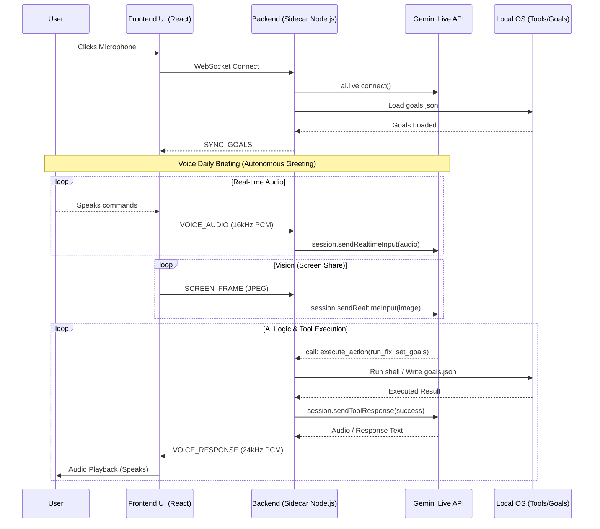

# System Architecture Diagram

This diagram visualizes how the Personal Operator interacts with the Google GenAI SDK and handles real-time audio through WebSockets.

```mermaid
sequenceDiagram
    participant User
    participant Frontend UI (React)
    participant Backend (Sidecar Node.js)
    participant Gemini Live API
    participant Local OS (Tools/Goals)
    
    User->>Frontend UI (React): Clicks Microphone
    Frontend UI (React)->>Backend (Sidecar Node.js): WebSocket Connect
    Backend (Sidecar Node.js)->>Gemini Live API: ai.live.connect()
    Backend (Sidecar Node.js)->>Local OS (Tools/Goals): Load goals.json
    Local OS (Tools/Goals)-->>Backend (Sidecar Node.js): Goals Loaded
    Backend (Sidecar Node.js)-->>Frontend UI (React): SYNC_GOALS
    
    Note over User,Gemini Live API: Voice Daily Briefing (Autonomous Greeting)
    
    loop Real-time Audio
        User-->>Frontend UI (React): Speaks commands
        Frontend UI (React)->>Backend (Sidecar Node.js): VOICE_AUDIO (16kHz PCM)
        Backend (Sidecar Node.js)->>Gemini Live API: session.sendRealtimeInput(audio)
    end
    
    loop Vision (Screen Share)
        Frontend UI (React)->>Backend (Sidecar Node.js): SCREEN_FRAME (JPEG)
        Backend (Sidecar Node.js)->>Gemini Live API: session.sendRealtimeInput(image)
    end
    
    loop AI Logic & Tool Execution
        Gemini Live API-->>Backend (Sidecar Node.js): call: execute_action(run_fix, set_goals)
        Backend (Sidecar Node.js)->>Local OS (Tools/Goals): Run shell / Write goals.json
        Local OS (Tools/Goals)-->>Backend (Sidecar Node.js): Executed Result
        Backend (Sidecar Node.js)->>Gemini Live API: session.sendToolResponse(success)
        
        Gemini Live API-->>Backend (Sidecar Node.js): Audio / Response Text
        Backend (Sidecar Node.js)-->>Frontend UI (React): VOICE_RESPONSE (24kHz PCM)
        Frontend UI (React)->>User: Audio Playback (Speaks)
    end
```
